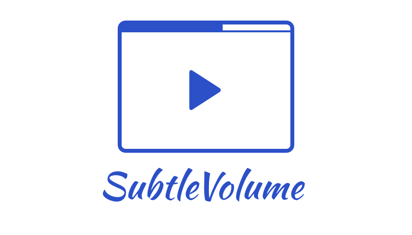

<p align="center">
  
</p>


Replace the volume popup with a more subtle way to display the volume when the user changes it with the volume rocker.

#Why and how
The iOS default popover showing the volume status that appears when the user clicks the volume rocker is a big obtrusive glossy view that covers the content shown. This library offers a way to show a more subtle indicator.  
To make sure that the popover is not shown there are two conditions that need to be satisfied:  
- An `AVAudioSession` needs to be active
- An `MPVolumeView` needs to be in the current view's hierarchy, and its alpha needs to be greater than 0

Once a `SubtleVolume` is added to your view, an audio session is automatically started, and the view's alpha is set to `0.0001` in the hidden state.

#Getting Started
Create an instance of `SubtleVolume` with one of its convenience initializers, and set its position (you can either set the frame or let autolayout handle it):
```swift
var volume = SubtleVolume(style: SubtleVolumeStyle.Plain)
volume.frame = CGRect(x: 0, y: 10, width: view.frame.size.width, height: 4)
```

Set the barTintColor property:
```swift
volume.barTintColor = .redColor()
```

Set the animation type if needed (no animation will result in the indicator being always visible):
```swift
volume.animation = .SlideDown
```

Add the view to your hierarchy:
```swift
view.addSubview(volume)
```

#WIP
This is currently in development and more of a proof of concept than anything else, feedback is really welcome. 

#TODO
- [ ] implement styles
- [ ] implement animations
- [ ] provide better samples
- [ ] add test coverage

#MIT License

	Copyright (c) 2016 Andrea Mazzini. All rights reserved.

	Permission is hereby granted, free of charge, to any person obtaining a
	copy of this software and associated documentation files (the "Software"),
	to deal in the Software without restriction, including
	without limitation the rights to use, copy, modify, merge, publish,
	distribute, sublicense, and/or sell copies of the Software, and to
	permit persons to whom the Software is furnished to do so, subject to
	the following conditions:

	The above copyright notice and this permission notice shall be included
	in all copies or substantial portions of the Software.

	THE SOFTWARE IS PROVIDED "AS IS", WITHOUT WARRANTY OF ANY KIND, EXPRESS
	OR IMPLIED, INCLUDING BUT NOT LIMITED TO THE WARRANTIES OF
	MERCHANTABILITY, FITNESS FOR A PARTICULAR PURPOSE AND NONINFRINGEMENT.
	IN NO EVENT SHALL THE AUTHORS OR COPYRIGHT HOLDERS BE LIABLE FOR ANY
	CLAIM, DAMAGES OR OTHER LIABILITY, WHETHER IN AN ACTION OF CONTRACT,
	TORT OR OTHERWISE, ARISING FROM, OUT OF OR IN CONNECTION WITH THE
	SOFTWARE OR THE USE OR OTHER DEALINGS IN THE SOFTWARE.
	
